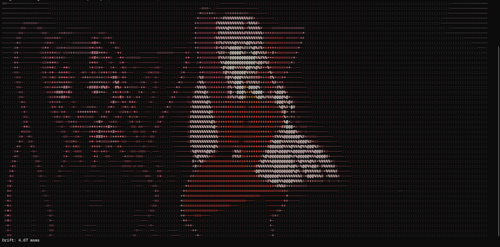
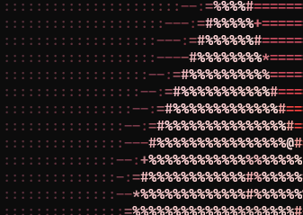

# TermTube 📺

<p align="center">
  
</p>

A high-performance command-line YouTube video and audio player that renders videos directly in your terminal using ANSI color codes or ASCII text art, synchronized with live audio.

Developed for modern terminal emulators with truecolor support.

---

## Features

- **ASCII Density Art (`--style ascii`)**: Renders details using a custom density character ramp while retaining true RGB color values per pixel.

  <p align="center">
    
    
  </p>

- **Truecolor Block Rendering (`--style halfblock`)**: Packs two vertical pixels per character cell using Unicode half-block characters (`▀`), rendering high-density full-color visual video frames.

  <p align="center">
    
  </p>

  <p align="center">
    
    
  </p>
- **Auto-Reconnection**: Resilient socket streaming. Ffmpeg/ffplay automatically reconnect and resume if YouTube throttles or drops the connection during playback.
- **Dynamic Terminal Scaling**: Auto-detects terminal width and height to fit the window cleanly, preventing awkward layout wraps or console buffer scrolling.
- **Synced Audio**: Launches synced audio streaming alongside the video with clock-driven drift tracking.

---

## Quick Start (No Installation Needed)

1. **Extract the project files** (if you downloaded the ZIP archive from GitHub) or open the project folder.
2. **Run the startup script** for your operating system:

   ### Windows
   Double-click `play.bat` or run it from your terminal:
   ```cmd
   play.bat
   ```

   ### macOS & Linux
   Run the shell script from your terminal:
   ```bash
   chmod +x play.sh
   ./play.sh
   ```

3. **Wait for Auto-Setup:** On the first run, the script will take a few minutes to automatically download and configure its own local Python interpreter, FFmpeg binaries, and dependencies.
4. **Play your video:**
   * Once the setup is complete, the script will prompt you to enter a YouTube video link.
   * Next, choose your preferred rendering style (Block characters for high-density color, or ASCII density characters for text art) and press Enter.

> [!NOTE]
> **Windows Security Warning ("Unknown Publisher")**: 
> Windows flags files downloaded directly from browsers (like GitHub ZIP releases) with a security warning. If you encounter this prompt:
> 1. Click **Run** to execute the script.
> 2. Alternatively, right-click `play.bat` -> select **Properties** -> check the **Unblock** box at the bottom -> click **OK** to permanently remove the warning.


---

## Native Installation (Global Command)

Alternatively, you can install the package globally to run `termtube` directly from anywhere in your console:

1. Change directory to `termtube` containing `pyproject.toml`:
   ```bash
   cd termtube
   ```
2. Install the package using `pip` (standard user-install or developer mode):
   ```bash
   pip install .
   ```
3. Run the player from any directory:
   ```bash
   termtube "https://www.youtube.com/watch?v=dQw4w9WgXcQ" --style ascii
   ```

*Ensure `ffmpeg` and `ffplay` are available on your system's `PATH` variable.*

---

## Command Line Arguments

```
Usage: play.bat/play.sh/termtube [url] [options]

Arguments:
  url                  YouTube video URL to stream

Options:
  --cols COLS          Target width in columns (default: None for auto-detect)
  --fps FPS            Target frames per second (default: 15)
  --style {halfblock,ascii}
                       Rendering style (default: halfblock)
  --ramp RAMP          ASCII character density ramp (default: ' .:-=+*#%@')
```

---

## Display Quality Note

TermTube's rendering detail depends on your terminal's font size, not on TermTube itself. This is a property of how terminals work — a terminal measures its size in character cells, not pixels, so:

- **Larger font size / higher display scaling** → fewer character cells fit on screen → lower detail
- **Smaller font size / lower display scaling** → more character cells fit on screen → higher detail

If your video looks blocky or low-detail, try reducing your terminal's font size (usually `Ctrl -` or `Cmd -` in most terminal apps) and rerun TermTube — this alone can dramatically sharpen the output without changing anything else. You can also override the auto-detected width manually with `--cols <number>` if you want to force a specific resolution.

### Finding your best balance

Higher detail (more columns, smaller font) means more text to render per frame, which can strain slower machines or connections — this can show up as choppy playback, audio/video drift, or dropped frames, especially on longer videos. If you notice this happening, there's a tradeoff to balance rather than a single "correct" setting:

- **Lower `--cols`** (or a larger terminal font) → less detail, but smoother and more stable playback
- **Lower `--fps`** (e.g. 15 instead of 24 or 30) → reduces how much rendering work happens per second, often the easiest fix for choppy playback
- **`--style halfblock`** vs **`--style ascii`** → try both, since render cost and visual density differ between the two modes
- Check the drift and dropped-frame numbers printed during/after playback — if drift keeps growing or a lot of frames are being dropped, that's a sign to reduce `--cols` and/or `--fps` until playback stabilizes

There's no single best setting for every machine — it depends on your terminal, hardware, and network speed. A bit of experimentation with these options usually finds a sweet spot between sharpness and smooth playback.

---

### Examples

- **High-definition color rendering**:
  ```bash
  termtube "https://www.youtube.com/watch?v=dQw4w9WgXcQ" --style halfblock --fps 15
  ```
- **ASCII style with manual width override (80 columns)**:
  ```bash
  termtube "https://www.youtube.com/watch?v=dQw4w9WgXcQ" --style ascii --cols 80
  ```
